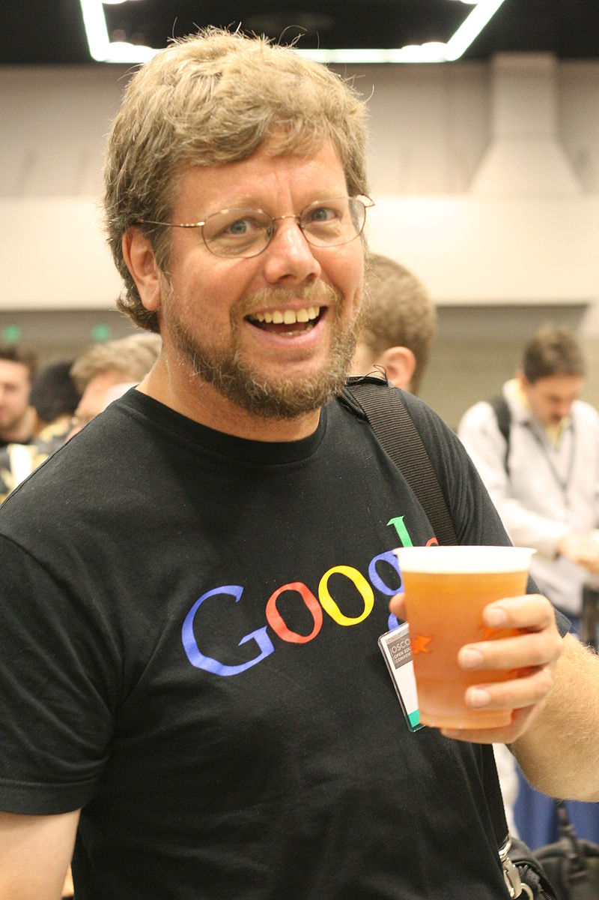
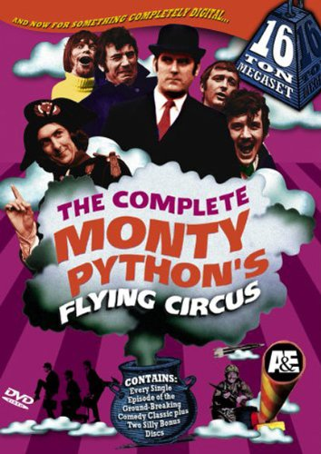
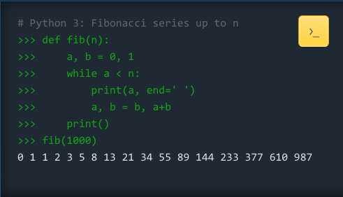
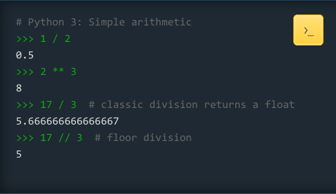
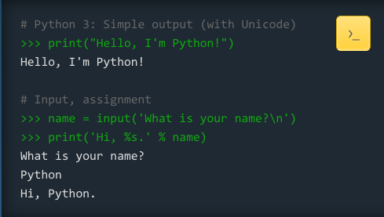
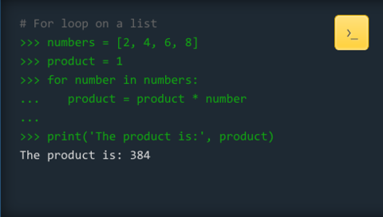
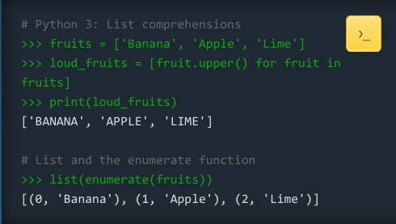
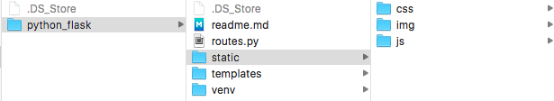
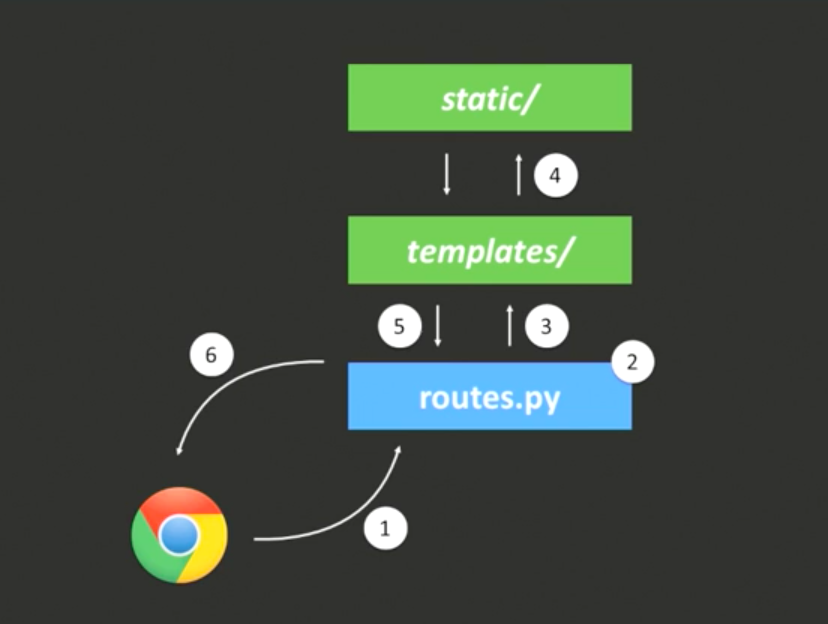
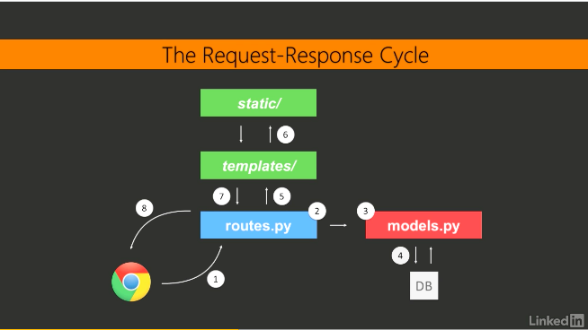

###### An introduction by Esraa and Francheska

# Python and Flask

### About Python

A widely used high-level interpreted programming language for general-purpose programming, created by Guido van Rossum  and first released in 1991.

Python's name is derived from the television series Monty Python's Flying Circus, and it is common to use Monty Python references in example code.

Python is a multi-paradigm programming language: object-oriented programming and structured programming are fully supported.

Python uses dynamic typing and a mix of reference counting and a cycle-detecting garbage collector for memory management. An important feature of Python is dynamic name resolution (late binding), which binds method and variable names during program execution.

The design of Python offers some support for functional programming in the Lisp tradition. The language has map(), reduce() and filter() functions; list comprehensions, dictionaries, and sets.

### Python has a design philosophy

- Beautiful is better than ugly

- Explicit is better than implicit

- Simple is better than complex

- Complex is better than complicated

- Readability counts

### Examples

[More examples](https://docs.python.org/3/tutorial/controlflow.html#defining-functions)

The python file extension is: .py

### About Flask

Flask was created by Armin Ronacher of Pocoo:

"It came out of an April Fool's joke but proved popular enough to make into a serious application in its own right."

Flask is a micro web framework written in Python, and is based on the Werkzeug toolkit (a utility library for Python) and Jinja2 (a template engine for Python), both of them Pocoo projects that were created.

Micro-framework are normally framework with little to no dependencies to external libraries or particular tools. This has pros and cons:

	Pros
	* The framework is light
	* There are little dependency to update and watch for security bugs

	Cons 
	* You will have to do more work by yourself
	* Increase yourself the list of dependencies by adding plugins. 

### Flask popularity

Despite the lack of a major release, Flask has become extremely popular among Python enthusiasts. As of mid 2016, it was the most popular Python web development framework on GitHub.

[Click here to see applications powered by Flask.](http://flask.pocoo.org/community/poweredby/)

### Sources

* [Official Python website](https://www.python.org/)

* [Flask website](http://flask.pocoo.org/)

* [Lynda tutorial called Learning Flash](https://www.lynda.com/Flask-tutorials/11121-0.html)

* [A tour of the differences between JavaScript and Python] (https://blog.glyphobet.net/essay/2557)

* [Python Tutorial: if __name__ == '__main__'] (https://www.youtube.com/watch?v=sugvnHA7ElY)

### Installation

1. open Terminal and run:
2. **brew install python**
3. **pip install -U pip setuptools**
4. **pip install virtualenv** (Virtualenv enables multiple side-by-side installations of Python, one for each project. It doesn’t actually install separate copies of Python, but it does provide a clever way to keep different project environments isolated.)

### Creating the Project Structure

1. cd Desktop
2. mkdir python_flask
3. cd python_flask
4. **virtualenv venv**
5. **source venv/bin/activate** 
	(Whenever you want to work on a project, you only have to activate the corresponding environment.) 
6. **pip install Flask**
7. mkdir static
8. cd static
9. mkdir css
10. cd css
11. touch main.css (most of the code provided by Lynda tutorial)
12. cd ..
13. mkdir js
14. mkdir img
15. cd ..
16. mkdir templates
17. cd templates
18. touch about.html (most of the code provided by Lynda tutorial)
19. touch index.html (most of the code provided by Lynda tutorial)
20. touch layout.html (most of the code provided by Lynda tutorial)
21. cd ..
22. touch routes.py (most of the code provided by Lynda tutorial)
23. touch readme.md
24. **python routes.py**
25. **open the browser and go to localhost:5000**

##### At the end, your folder should look like this:

### Request-Response Cycle

